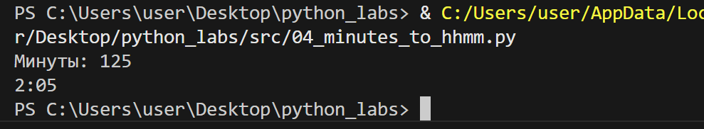

# PYTHON LABS
<!-- ## LAB_01
### Задание 1

```
name = str(input('Имя: '))
age = int(input('Возраст: '))
print(f'Привет, {name}! Через год тебе будет {age+1}.')
```


### Задание 2

```
a = float(str(input('a: ')).replace(',', '.'))
b = float(str(input('b: ')).replace(',', '.'))
print(f'sum={format(a+b, '.2f')}; avg={format((a+b)/2, '.2f')}')
```


### Задание 3

```
price = int(input())
discount = int(input())
vat = int(input())
base = price * (1 - discount / 100)
vat_amount = base * (vat / 100)
total = base + vat_amount
print(f"База после скидки: {format(base, '.2f')} руб")
print(f"НДС:               {format(vat_amount, '.2f')} руб")
print(f"Итого к оплате:    {format(total, '.2f')} руб")
```


### Задание 4

```
min = int(input('Минуты: '))
print(f'{(min // 60):02d}:{(min % 60):02d}')
```



### Задание 5

```
fio = str(input('ФИО: '))
for i in range(len(fio)):
    fio = fio.replace(" ", "")
init = ''
for i in fio:
    if i.upper() == i:
        init += i
print(f'Инициалы: {init}.')
print('Длина (символов):', len(fio) + 2)
```

 -->

## LAB_02

### Задание 1 (min_max)

```
def min_max(nums: list[float | int]) -> tuple[float | int, float | int]:

    if nums == []:
        return ValueError('ValueError') 
    '''Возвращает ValueError, если список пустой'''
    
    mini = nums[0]
    for next in nums:
        if next < mini:
            mini = next 
    maxi = nums[0]
    for next in nums:
        if next > mini:
            maxi = next 

    return mini, maxi 
    '''В другом случае возвращает минимум и максимум из списка'''
```


### Задание 1 (unique_sorted)

```
def unique_sorted(nums: list[float | int]) -> list[float | int]:

    nums = list(set(nums))
    n = len(nums)
    for i in range(n):
        for j in range(0, n - i - 1):
            if nums[j] > nums[j + 1]:
                nums[j], nums[j + 1] = nums[j + 1], nums[j]

                '''Сортировка пузырьком'''
                
    return nums
```


### Задание 1 (flatten)

```
def flatten(mat: list[list | tuple]) -> list:
    
    new_mat = []
    for elements in mat:
            if isinstance(elements, tuple | list):
                '''Проверяет, список.кортеж ли элемент'''

                for element in elements:
                    new_mat.append(element)
                '''Если все элементы удовлетворяют условию, то проходимся по элементам внутри каждого из них'''
                
            else:
                return TypeError('TypeError')
            '''Если есть элемент, не являющийся списком/кортежем, выводит ошибку'''

    return new_mat
```


### Задание 2 (transpose)

```
def transpose(mat: list[list[float | int]]) -> list[list]:

    if not mat:
        return []
        '''Проверка наличия элементов в матрице'''
    len_row = len(mat[0])
    len_col = len(mat)
    
    for num in range(len(mat) - 1):
        if len(mat[num]) != len(mat[num + 1]):
            return ValueError('ValueError')
            '''Проверка на одинаковую длину строк'''

    new_mat =[]
    for col_ind in range(len_row):
        new_row = []
        '''С каждым запуске цикла создаётся ряд, рядов столько, сколько столбцов в изначальной матрице'''
        for row_ind in range(len_col):
            new_row.append(mat[row_ind][col_ind])
            '''Элементов в ряд добавляется столько, сколько столбцов в изначальной матрице'''
        new_mat.append(new_row)
        '''Ряд добавляется в новую матрицу'''

    return new_mat
```


### Задание 2 (row_sums)

```
def row_sums(mat: list[list[float | int]]) -> list[float]:

    len_row = len(mat[0])
    len_col = len(mat)
    
    for num in range(len(mat) - 1):
        if len(mat[num]) != len(mat[num + 1]):
            return ValueError('ValueError')
            '''Проверка на одинаковую длину строк'''

    sum_row = []
    for row in mat:
        sum_row.append(sum(row))

    return sum_row
```


### Задание 2 (col_sums)

```
def col_sums(mat: list[list[float | int]]) -> list[float]:

    len_row = len(mat[0])
    len_col = len(mat)
    
    for num in range(len(mat) - 1):
        if len(mat[num]) != len(mat[num + 1]):
            return ValueError('ValueError')
            '''Проверка на одинаковую длину строк'''

    sum_col = []
    for col in range(len_row):
        summa = 0
        for row in range(len_col):
            summa += mat[row][col]
        sum_col.append(summa)
    
    return sum_col
```


### Задание 3 (tuples)

```
def format_record(rec: tuple[str, str, float]) -> str:

    fio = rec[0].title().split()
    if fio == [] or len(fio) == 1 or rec[1] == [] or rec[2] == []:
        return ValueError("ValueError")
    '''ValueError, если пустые имя/группа/GPA'''

   if  not isinstance(rec[0], str) or not isinstance(rec[1], str) or not isinstance(rec[2], float) :
        if not isinstance(rec, tuple):
            return TypeError('TypeError')
    '''TypeError, если некорректный тип данных'''
    

    if len(fio) == 3:
        f_io = f"{fio[0]} {fio[1][0]}. {fio[2][0]}."
    else:
        f_io = f"{fio[0]} {fio[1][0]}."
    """В 1 элементе кортежа все 1 буквы становятся прописными,
       в f_io сохраняются фамилия и инициалы"""
    
    GPA = f'GPA {format(round(rec[2], 2), '.2f')}'
    '''Округление, 2 знака после запятой '''

    return f'{f_io}, гр. {rec[1]}, {GPA}'

print(format_record(("Иванов Иван Иванович", "BIVT-25", 4.6)))
print(format_record(("Петров Пётр", "IKBO-12", 5.0)))
print(format_record(("Петров Пётр Петрович", "IKBO-12", 5.0)))
print(format_record(("  сидорова  анна   сергеевна ", "ABB-01", 3.999)))
```


##LAB_03

### Задание 1 (normalize)

```
def normalize(text: str, *, casefold: bool = True, yo2e: bool = True) -> str:

    '''
    Если casefold=True — привести к casefold (лучше, чем lower для Юникода).
    Если yo2e=True — заменить все ё/Ё на е/Е.
    Убрать невидимые управляющие символы (например, \t, \r) →
    заменить на пробелы, схлопнуть повторяющиеся пробелы в один.
    '''

    if casefold == True:
        text = text.casefold() #строку в нижний регистр

    if yo2e == True:
        text = text.replace('ё', 'е')
    
    text = text.replace('\t', ' ').replace('\n', ' ').replace('\r', ' ')
    norm = ' '.join(text.split())
    return norm

assert normalize("ПрИвЕт\nМИр\t") == "привет мир"
assert normalize("ёжик, Ёлка") == "ежик, елка"
assert normalize("Hello\r\nWorld") == "hello world"
assert normalize("  двойные   пробелы  ") == "двойные пробелы"

```


### Задание 1 (tokenize)

```
Доделать!!!!!
```


### Задание 1 (count_freq)

```
def count_freq(tokens: list[str]) -> dict[str, int]:

    '''Подсчитать частоты, вернуть словарь слово → количество.'''

    dict = {}

    for token in tokens: #пробегаемся по каждому токену
        dict[token] = dict.get(token, 0) + 1
        '''get возвращает текущее значение, если token уже есть в словаре + 1
           или 0 + 1, если в словаре token отсутсвует '''

    return dict

freq = count_freq(["a","b","a","c","b","a"])
assert freq == {"a":3, "b":2, "c":1}
```


### Задание 1 (top_n)

```
def top_n(freq: dict[str, int], n: int = 2) -> list[tuple[str, int]]:

    '''Вернуть топ-N по убыванию частоты; при равенстве — по алфавиту слова.'''

    sorted_items = sorted(freq.items(), key = lambda x : x[1])[::-1]
    sorted_items = sorted(freq.items(), key = lambda x : x[0])
    '''Сортируем словарь сначала по частотам ([::-1] для того, чтобы сначала отображался самый большой), потом по алфавиту'''

    return sorted_items[:n]
    '''Возвращаем первые n элементов'''

freq = count_freq(["a","b","a","c","b","a"])
assert top_n(freq, 2) == [("a",3), ("b",2)]
```


