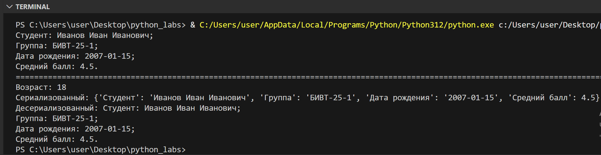
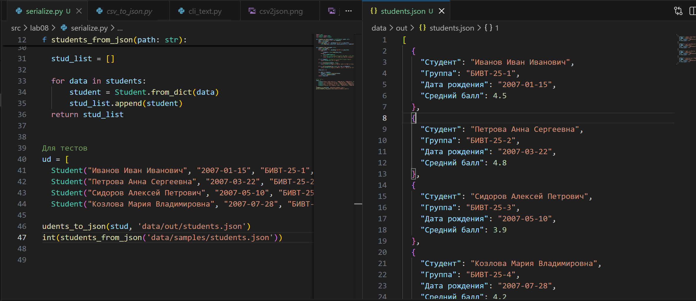

<!-- # PYTHON LABS
## LAB_01
### Задание 1

```py
name = str(input('Имя: '))
age = int(input('Возраст: '))
print(f'Привет, {name}! Через год тебе будет {age+1}.')
```


### Задание 2

```py
a = float(str(input('a: ')).replace(',', '.'))
b = float(str(input('b: ')).replace(',', '.'))
print(f'sum={format(a+b, '.2f')}; avg={format((a+b)/2, '.2f')}')
```


### Задание 3

```py
price = int(input())
discount = int(input())
vat = int(input())
base = price * (1 - discount / 100)
vat_amount = base * (vat / 100)
total = base + vat_amount
print(f"База после скидки: {format(base, '.2f')} руб")
print(f"НДС:               {format(vat_amount, '.2f')} руб")
print(f"Итого к оплате:    {format(total, '.2f')} руб")
```


### Задание 4

```py
min = int(input('Минуты: '))
print(f'{(min // 60):02d}:{(min % 60):02d}')
```


### Задание 5

```py
fio = str(input('ФИО: '))
for i in range(len(fio)):
    fio = fio.replace(" ", "")
init = ''
for i in fio:
    if i.upper() == i:
        init += i
print(f'Инициалы: {init}.')
print('Длина (символов):', len(fio) + 2)
```


## LAB_02

### Задание 1 (min_max)

```py
def min_max(nums: list[float | int]) -> tuple[float | int, float | int]:

    if nums == []:
        raise ValueError('Список пустой') 
    '''Возвращает ValueError, если список пустой'''
    
    mini = nums[0]
    for next in nums:
        if next < mini:
            mini = next 
    maxi = nums[0]
    for next in nums:
        if next > mini:
            maxi = next 

    return mini, maxi 
    '''В другом случае возвращает минимум и максимум из списка'''
```


### Задание 1 (unique_sorted)

```py
def unique_sorted(nums: list[float | int]) -> list[float | int]:

    nums = list(set(nums))
    n = len(nums)
    for i in range(n):
        for j in range(0, n - i - 1):
            if nums[j] > nums[j + 1]:
                nums[j], nums[j + 1] = nums[j + 1], nums[j]

                '''
                Сортировка пузырьком:
                Каждый проход бОльшего цикла "всплывает" самый большой элемент из
                неотсортированной части. С каждым проходом сокращаем диапазон, т.к.
                последние i элементов уже на своих местах. Сравниваем последние числа
                '''
                
    return nums
```


### Задание 1 (flatten)

```py
def flatten(mat: list[list | tuple]) -> list:
    
    new_mat = []
    for elements in mat:
            if isinstance(elements, tuple | list):
                '''Проверяет, список/кортеж ли элемент'''

                for element in elements:
                    new_mat.append(element)
                '''
                Если все элементы удовлетворяют условию, то проходимся по
                элементам внутри каждого из них и добавляем в "сплющенную" матрицу
                '''
                
            else:
                raise TypeError('Элемент не того типа данных')
            '''Если есть элемент, не являющийся списком/кортежем, выводит ошибку'''

    return new_mat
```


### Задание 2 (transpose)

```py
def transpose(mat: list[list[float | int]]) -> list[list]:

    if not mat:
        return []
        '''Проверка наличия элементов в матрице'''
    
    for num in range(len(mat) - 1):
        if len(mat[num]) != len(mat[num + 1]):
            raise ValueError('Матрица рваная')
            '''Проверка на одинаковую длину строк'''

    len_row = len(mat[0])
    len_col = len(mat)
    new_mat =[]

    for col_ind in range(len_row):
        new_row = []
        '''
        C каждым запуском цикла создаётся ряд, рядов столько,
        сколько столбцов в изначальной матрице
        '''
        for row_ind in range(len_col):
            new_row.append(mat[row_ind][col_ind])
            '''
            Элементов в ряд добавляется столько, сколько
            столбцов в изначальной матрице
            '''
        new_mat.append(new_row)
        '''Ряд добавляется в новую матрицу'''

    return new_mat
```


### Задание 2 (row_sums)

```py
def row_sums(mat: list[list[float | int]]) -> list[float]:
    
    for num in range(len(mat) - 1):
        if len(mat[num]) != len(mat[num + 1]):
            raise ValueError('Матрица рваная')
            '''Проверка на одинаковую длину строк'''

    sum_row = []

    for row in mat:
        sum_row.append(sum(row))

    return sum_row
```


### Задание 2 (col_sums)

```py
def col_sums(mat: list[list[float | int]]) -> list[float]:

    len_row = len(mat[0])
    len_col = len(mat)
    
    for num in range(len(mat) - 1):
        if len(mat[num]) != len(mat[num + 1]):
            raise ValueError('Матрица рваная')
            '''Проверка на одинаковую длину строк'''

    sum_col = []

    for col in range(len_row):
        summa = 0
        for row in range(len_col):
            summa += mat[row][col] #меняем индексы местами
        sum_col.append(summa)
    
    return sum_col
```


### Задание 3 (tuples)

```py
def format_record(rec: tuple[str, str, float]) -> str:

    fio = rec[0].title().split()
    if fio == [] or len(fio) == 1 or rec[1] == [] or rec[2] == []:
        raise ValueError("Пустые значения")
    '''ValueError, если пустые имя/группа/GPA'''

   if  not isinstance(rec[0], str) or not isinstance(rec[1], str) or not isinstance(rec[2], float) :
        if not isinstance(rec, tuple):
            raise TypeError('Некорректный тип данных')
    '''TypeError, если некорректный тип данных'''
    

    if len(fio) == 3:
        f_io = f"{fio[0]} {fio[1][0]}. {fio[2][0]}."
    else:
        f_io = f"{fio[0]} {fio[1][0]}."
    """В 1 элементе кортежа все 1 буквы становятся прописными,
       в f_io сохраняются фамилия и инициалы"""
    
    GPA = f'GPA {format(round(rec[2], 2), '.2f')}'
    '''Округление (round), 2 знака после запятой(format)'''

    return f'{f_io}, гр. {rec[1]}, {GPA}'

print(format_record(("Иванов Иван Иванович", "BIVT-25", 4.6)))
print(format_record(("Петров Пётр", "IKBO-12", 5.0)))
print(format_record(("Петров Пётр Петрович", "IKBO-12", 5.0)))
print(format_record(("  сидорова  анна   сергеевна ", "ABB-01", 3.999)))
```


## LAB_03

### Задание 1 (normalize)

```py
def normalize(text: str, *, casefold: bool = True, yo2e: bool = True) -> str:

    '''
    Если casefold=True — привести к casefold (лучше, чем lower для Юникода).
    Если yo2e=True — заменить все ё/Ё на е/Е.
    Убрать невидимые управляющие символы (например, \t, \r) →
    заменить на пробелы, схлопнуть повторяющиеся пробелы в один.
    '''

    if casefold == True:
        text = text.casefold()    # строку в нижний регистр

    if yo2e == True:
        text = text.replace('ё', 'е')
    
    text = text.replace('\t', ' ').replace('\n', ' ').replace('\r', ' ')
    norm = ' '.join(text.split())
    '''
    Cплитом убираем все пробелы; получившийся список методом
    " ".join() снова превращаем в строку
    '''
    return norm

assert normalize("ПрИвЕт\nМИр\t") == "привет мир"
assert normalize("ёжик, Ёлка") == "ежик, елка"
assert normalize("Hello\r\nWorld") == "hello world"
assert normalize("  двойные   пробелы  ") == "двойные пробелы"

```


### Задание 1 (tokenize)

```py
import re  

def tokenize(text: str) -> list[str]:
    '''
    Разбить на «слова» по небуквенно-цифровым разделителям.
    В качестве слова считаем последовательности символов \w 
    (буквы/цифры/подчёркивание) плюс дефис внутри слова (например, по-настоящему).
    Числа (например, 2025) считаем словами.

    Множество слов — это все подстроки, удовлетворяющие шаблону
    \w+(?:-\w+)*
    (буквы/цифры/подчёркивание; допускается дефис внутри слова), разделённые
    любыми не-\w символами.
    '''
    key = r'\w+(?:-\w+)*'

    '''
    Регулярное выражение (находит все совпадения шаблону '\w+(?:-\w+)*')
    имеет структуру r'...':
    1) \w+ означает один или более символов типа букв, цифр, подчёркивание
    2) (?:...) - незахватывающая группа. То есть всё, что после дефиса,
       не будет запоминаться как отдельное слово, оно будет присоединенино к предыдущему нахождению.
    3) -\w+ - буквы и цифры после дефиса
    4) * означает любое количество подобных вхождений (0-бесконечность)
    '''
    
    # Находим все совпадения через findall. tokens - это список
    tokens = re.findall(key, text)
    
    return tokens

assert tokenize("привет, мир!") == ["привет", "мир"]
assert tokenize("по-настоящему круто") == ["по-настоящему", "круто"]
assert tokenize("2025 год") == ["2025", "год"]

```


### Задание 1 (count_freq)

```py
def count_freq(tokens: list[str]) -> dict[str, int]:

    '''Подсчитать частоты, вернуть словарь слово → количество.'''

    freq = {} #создаём словарь, в который и будем вносить слова и частоты

    for key in tokens: #пробегаемся по каждому токену
        freq[key] = freq.get(key, 0) + 1
        '''get возвращает текущее значение, если ключ уже есть в словаре + 1
           или 0 + 1, если в словаре ключа еще нет в словаре. Он появляетя там в виде {key:1} '''

    return freq

freq = count_freq(["a","b","a","c","b","a"])
assert freq == {"a":3, "b":2, "c":1}
```


### Задание 1 (top_n)

```py
def top_n(freq: dict[str, int], n: int = 2) -> list[tuple[str, int]]:

    '''Вернуть топ-N по убыванию частоты; при равенстве — по алфавиту слова.'''

    sorted_items = sorted(freq.items())
    sorted_items = sorted(sorted_items, key = lambda x : x[1], reverse = True)
    '''
    Сортируем словарь сначала по алфавиту, потом уже отсортированный словарь
    (теперь список кортежей) сортируем по частотам (reverse для того, чтобы сначала
    отображался самый большой).
    Что делает lambda x: мини-функция, которая возвращает элемент x[1] кортежа ('слово', частота)
    => он становится ключом. Первая сортировка работает и без ключа, так как по умолчанию
    функция sorted сортирует по 1 элементу (в нашем случаю - по ключу)
    '''

    return sorted_items[:n]
    '''Возвращаем первые n элементов срезом'''

freq = count_freq(["a","b","a","c","b","a"])
assert top_n(freq, 2) == [("a",3), ("b",2)]
```


### Задание 2 (text_stats)

```py
import sys   #импортируем систему, чтобы применить ввод stdin и добавить путь к папке
sys.path.append('C:/Users/user/Desktop/python_labs/src')  #добавляем путь к папке, чтобы он нашел папку lib
from lib.text import normalize, tokenize, count_freq, top_n

def main():

    line = sys.stdin.read()   #Читает весь ввод до конца файла. Сtrl+Z+Enter для прерывания ввода
    
    norm_line = tokenize(normalize(line))   #без этого шага слова в верхнем и нижнем регистре будут считаться разными
    uniq_line = len(set(norm_line))   #set возвращает список уникальных элементов (без повтроений)
    freq = count_freq(norm_line)
    top5 = top_n(freq, 5)


    print('Всего слов:', len(norm_line))
    print('Уникальных слов:', uniq_line)
    print('Топ-5:')
    for i in top5:   #цикл для ввода в i=5 строк
        print( f'{i[0]}:{i[1]}') 

while True:  #опционально: для бесконечного вызова функции
    main()   #вызов функции
```
 -->

<!-- ## LAB_04

### Задание A (read_text)


```py
from pathlib import Path

def read_text(path: str | Path, encoding: str = "utf-8") -> str:

    '''
    Открыть файл на чтение в указанной кодировке и вернуть содержимое как одну строку.
    Обрабатывать ошибки: если файл не найден — поднимать FileNotFoundError (пусть падает),
    если кодировка не подходит — поднимать UnicodeDecodeError (пусть падает).
    '''

    p = Path(path)   # Создаем путь к файлу - Path-объект
    
    if not p.exists():   # Явная проверка существования файла
        raise FileNotFoundError('Файл не найден')

    '''
    UnicodeDecodeError поднимается автоматически.
    Для использования разых кодировок необходимо прописать в вызове функции параметр
    encoding=... . 
    Примеры:
    по умолчанию UTF-8: read_text("file.txt")
    другие: read_text("file.txt", encoding="cp1251")
            read_text("file.txt", encoding="koi8-r")
    '''
    return p.read_text(encoding=encoding)

```
```py
import csv
from pathlib import Path
from typing import Iterable, Sequence

def write_csv(rows: Iterable[Sequence], path: str | Path, header: tuple[str, ...] | None = None) -> None:

    '''
    Создать/перезаписать CSV с разделителем ,.
    Если передан header, записать его первой строкой.
    Проверить, что каждая строка в rows имеет одинаковую длину (иначе ValueError).
    '''

    p = Path(path)   # Создаем путь
    rows = list(rows)
    '''
    Если на вход функции подавался не список, а другой итерируемый объект (например, кортеж)
    - превращаем его в список. Фиксирует данные на момент вызова функции созданием нового списка.
    '''
    with p.open('w', newline='', encoding = 'utf-8') as f:
        '''
        Через менеджер контекста (автозакрытие файла+устойчивость к ошибкам) открываем
        файл в режиме 'w' - чтения, кодировка UTF-8. 
        newline="" позволяет избавиться от проблем при работе с файлом в разных ОС.
        Автоматическое преобразование перевода строк
        '''
        w = csv.writer(f)   # Создание объекта writer для записи в csv формат
        if header is not None:
            w.writerow(header)   # Записываем заголовок, если такой существует
        
        if rows:    # Проверка не равную длину строк
            for r in rows:
                if len(r) != len(rows[0]):
                    raise ValueError("Строки имеют разную длину!")

        for r in rows:
            w.writerow(r)   # Записывает ряды построчно

'''Функция не возвращает ничего, она записывает данные в CSV файл.'''
```
```py
from pathlib import Path

def ensure_parent_dir(path: Path | str) -> None:

    p = Path(path)
    parent_dir = p.parent
    
    '''
    Создаём родительскую директорию если её нет
    parents=True - создаёт все промежуточные директории
    exist_ok=True - не вызывает ошибку если директория уже существует
    '''
    
    parent_dir.mkdir(parents=True, exist_ok=True)
```


### Задание B

```py
import sys   
sys.path.append('C:/Users/user/Desktop/python_labs/src')
from lib.text import normalize, tokenize, count_freq, top_n
from lib.io_txt_csv import read_text, write_csv, write_text


txt = read_text('data/input.txt')
txt = tokenize(normalize(txt))
txt_counts = top_n(count_freq(txt))
print('Всего слов:', len(txt))
print('Уникальных слов:', len(set(txt)))
print('Топ-5:')
for i in txt_counts:  
    print( f'{i[0]}:{i[1]}') 

write_csv(txt_counts, 'data/report.csv', ("word","count"))
```


 -->

<!-- 
## LAB_05

### Задание A (json_to_csv)
```py
from pathlib import Path
import json
import csv
import sys
sys.path.append('C:/Users/user/Desktop/python_labs/')

def json_to_csv(json_path: str, csv_path: str) -> None:
    """
    Преобразует JSON-файл в CSV.
    Поддерживает список словарей [{...}, {...}], заполняет отсутствующие поля пустыми строками.
    Кодировка UTF-8. Порядок колонок — как в первом объекте или алфавитный (указать в README).
    """
    json_path = Path(json_path)   # Создаем путь к файлу - Path-объект
    
    if not json_path.exists():   # Явная проверка существования пути
        raise FileExistsError('Путь не найден')
    '''
    Работаем с открытым JSON-файлом на чтение, загружаем его, паралелльно отлавливая ошибки.
    '''
    with open(json_path, 'r', encoding='utf-8') as json_file:
        try:
            data_json = json.load(json_file)

        except json.JSONDecodeError:   # Выходит, когда файл невозможно загрузить в формате JSON
            raise ValueError("Пустой JSON или неподдерживаемая структура")
        
    if not data_json:  # Явная проверка существования файла
        raise FileNotFoundError("Файл не найден")
        
    if not isinstance(data_json, list):
        raise ValueError('Файл не JSON формата: не список словарей')
        
    if not all(isinstance(row, dict) for row in data_json):
        raise ValueError('Файл не JSON формата: в списке не словари')
    '''
    Работаем с CSV-файлом, записывая в него данные из загруженного ранее JSON-файла.
    '''

    csv_path = Path(csv_path)

    with open(csv_path, 'w', encoding='utf-8', newline='') as csv_file:
        writer = csv.DictWriter(csv_file, fieldnames=data_json[0].keys()) # Записывает список словарей, заголовок - ключи словарей
        writer.writeheader()
        writer.writerows(data_json) # Записываем данные построчно

```


### Задание A (csv_to_json)

```py
from pathlib import Path
import json
import csv
import sys
sys.path.append('C:/Users/user/Desktop/python_labs/')

def csv_to_json(csv_path: str, json_path: str) -> None:
    """
    Преобразует CSV в JSON (список словарей).
    Заголовок обязателен, значения сохраняются как строки.
    json.dump(..., ensure_ascii=False, indent=2)
    """

    csv_path = Path(csv_path)

    if not csv_path.exists():
        raise FileNotFoundError('Файл не найден')
    
    if csv_path.suffix != '.csv':
            raise ValueError("Неверный тип файла")
    '''
    Работаем с открытым CSV-файлом, пробуем читать как список словарей и отлавливаем ошибки.
    '''
    with open(csv_path, 'r', encoding='utf-8') as csv_file:
        try:
            data_csv = csv.DictReader(csv_file)

        except data_csv.fieldnames is None:
            raise ValueError('Отсутствуют заголовки')
        
        if len(list(data_csv)) == 0:
             raise ValueError("Пустой файл")
        data_csv = list(data_csv) # Создаёт список данных, сохраняем считанные данные

    json_path = Path(json_path)
    '''
    Работаем с JSON-файлом, загружая в него данные из CSV_файла.
    '''
    with open(json_path, 'w', encoding='utf-8') as json_file:
        json.dump(json.dump(data_csv, json_file, ensure_ascii=False, indent=2))
        '''
        data_csv - что записываем
        json_file -  куда записываем
        ensure_ascii=False - корректная работа с кириллицей
        indent=2 - красивый вывод
        '''
```


### Задание B (csv_to_xlsx)
```py
from pathlib import Path
import csv
from openpyxl import Workbook
from openpyxl.utils import get_column_letter # Утилита openpyxl для получения буквы столбца таблицы

def csv_to_xlsx(csv_path: str, xlsx_path: str) -> None:
    """
    Конвертирует CSV в XLSX.
    Использовать openpyxl ИЛИ xlsxwriter.
    Первая строка CSV — заголовок.
    Лист называется "Sheet1".
    Колонки — автоширина по длине текста (не менее 8 символов).
    """

    csv_path = Path(csv_path)
    xlsx_path = Path(xlsx_path)

    if not csv_path.exists():  # Явная проверка существования файла
        raise FileNotFoundError('Файл не найден')
    
    if not xlsx_path.exists():  # Явная проверка существования файла
        raise FileNotFoundError('Файл не найден')
    
    if csv_path.suffix != '.csv':
            raise ValueError("Неверный тип файла")
    '''
    Работаем с CSV-файлом, читаем из него информацию и проверяем на наличие ошибок. Если они есть - они всплывают.
    '''
    with open(csv_path, 'r', encoding='utf-8') as csv_file:
        reader = csv.DictReader(csv_file)
        csv_file = list(reader) # Сохраняем считанные данные в список
        if len(csv_file) == 0:
             raise ValueError("Пустой файл")
        
        if not reader.fieldnames:
             raise ValueError('Файл не содержит заголовков')
        
        wb = Workbook()      # Создаем рабочую книгу
        ws = wb.active       # Создаём в ней новый лист
        ws.title = "Sheet1"  # Называем его

        ws.append(reader.fieldnames)  # Добавляем заголовок
        for row in csv_file:
            ws.append([row[field] for field in reader.fieldnames])  # В каждую строку таблицы добавляем соответствующую ей информацию
        
        for column in ws.columns:   # Равняем всё по ширине, 8 - минимум
            max_length = 8
            column_letter = get_column_letter(column[0].column)
            for cell in column:
                max_length = max(len(str(cell.value)), max_length)

            ws.column_dimensions[column_letter].width = max_length
            

    wb.save(xlsx_path)  # Сохраняем все изменения в указанном пути
```
 -->

<!-- ## LAB_06
### CLI_text
```py
import argparse
from pathlib import Path
from src.lib.text import tokenize, count_freq, top_n

def main():

    parser = argparse.ArgumentParser(description='CLI-утилиты лабораторной №6')
    '''Создает основной парсер аргументов с описанием'''
    subparsers = parser.add_subparsers(dest='command')
    '''Создает подкоманды - в дальнейшем cat и stats'''

    # Подкоманда cat - утилита для просмотра содержимого текстовых файлов в терминале.
    cat_parser = subparsers.add_parser("cat", help="Вывести содержимое файла")
    cat_parser.add_argument("--input", required=True, help="Путь к входному файлу")
    cat_parser.add_argument("-n", action="store_true", help="Нумеровать строки")
    '''action="store_true" - если флаг указан, значение становится True, иначе False'''

    # Подкоманда stats -  утилита для адализа текстовой статистики
    stats_parser = subparsers.add_parser("stats", help="Частоты слов")
    stats_parser.add_argument("--input", required=True)
    stats_parser.add_argument("--top", type=int, default=5)
    '''type=int - автоматически преобразует введенное значение в число, по дефолту
       выводит топ-5'''
    
    args = parser.parse_args() # "Анализирует" значения на входе

    file = Path(args.input)

    if args.command == "cat":
        with open(file, 'r', encoding='utf-8') as f:
            count = 1
            for line in f: # Построчное чтение файла
                line = line.rstrip("\n") # Очищаем строку от символа переноса
                if args.n: # Если указан флаг -n, то проводим нумерацию строк
                    print(f'{count}: {line}')
                    count += 1
                else:
                    print(line)
            
    elif args.command == 'stats':
        with open(file, 'r', encoding='utf-8') as f:
            file = [i for i in f]
            tokens = tokenize(''.join(file))
            freq = count_freq(tokens)
            top = top_n(freq, n = args.top)
            '''Работаем с входными данными'''

            num = 1
    
            for word, count in top:
                print(f'{num}. {word} - {count}')
                num += 1

# Точка - запуск программы
if __name__ == "__main__":
    main()
```


### CLI_convert

```py
import argparse
import sys
from src.lab05.json_to_csv import json_to_csv
from src.lab05.csv_to_json import csv_to_json
from src.lab05.csv_to_xlsx import csv_to_xlsx

def main():
    parser = argparse.ArgumentParser(description="Конвертеры данных")
    sub = parser.add_subparsers(dest="command")

    p1 = sub.add_parser("json2csv")
    p1.add_argument("--in", dest="input", required=True)
    p1.add_argument("--out", dest="output", required=True)

    p2 = sub.add_parser("csv2json")
    p2.add_argument("--in", dest="input", required=True)
    p2.add_argument("--out", dest="output", required=True)

    p3 = sub.add_parser("csv2xlsx")
    p3.add_argument("--in", dest="input", required=True)
    p3.add_argument("--out", dest="output", required=True)

    args = parser.parse_args() # "Анализирует" значения на входе

    if args.command == "json2csv":
        # Python -m src.lab06.cli_convert json2csv --in data/samples/people.json --out data/out/people_from_json.csv
        json_to_csv(json_path=args.input, csv_path=args.output)

    if args.command == "csv2json":
        # Python -m src.lab06.cli_convert csv2json --in data/samples/people.csv --out data/out/people_from_csv.json
        csv_to_json(csv_path=args.input, json_path=args.output)

    if args.command == "csv2xlsx":
        # Python -m src.lab06.cli_convert csv2xlsx --in data/samples/cities.csv --out data/out/cities.xlsx
        csv_to_xlsx(csv_path=args.input, xlsx_path=args.output)

if __name__ == "__main__":
    main()
```


## LAB_07

### Предустановки
> Добавить файл pyproject.toml для настройки поведения тестов. Установить pytest и black, совместимые с версией Python

### Задание A: test_text
```py
import pytest
import sys
from src.lib.text import normalize, tokenize, count_freq, top_n


""" Проводим параметризацию, далее - для каждого теста. """
@pytest.mark.parametrize(
    "source, expected",
    [
        ("ПрИвЕт\nМИр\t", "привет мир"),
        ("ёжик, Ёлкa", "ежик, елкa"),
        ("Hello\r\nWorld", "hello world"),
        ("  двойные   пробелы  ", "двойные пробелы"),
        ("", "")
    ],
)
def test_normalize_basic(source, expected):
    assert normalize(source) == expected


@pytest.mark.parametrize(
    "source, expected",
    [
        ("привет, мир!", ["привет", "мир"]),
        ("по-настоящему круто", ["по-настоящему", "круто"]),   # работа с дефисом
        ("2025 год", ["2025", "год"]),   # чтение 
        ("emoji 😀 не слово", ["emoji", "не", "слово"]),    # удаление эмоджи
        ("    мноооооого ненужного!!", ["мноооооого", "ненужного"]),
        ("", [])   # пустой -> пустой
    ],
)
def test_tokenize_basic(source, expected):
    assert tokenize(source) == expected
    
@pytest.mark.parametrize(
    "tokens, expected",
    [
        (["a", "b", "a", "c", "b", "a"], {"a": 3, "b": 2, "c": 1}),
        ([], {}),   # пустой -> пустой
        (["test", "test", "test"], {"test": 3}),   #одинаковые слова
        (["🌍", "🚀", "🌍"], {"🌍": 2, "🚀": 1})   # обработка эмодзи
    ],
)

def test_count_freq_and_top_n(tokens, expected):
    assert count_freq(tokens) == expected

@pytest.mark.parametrize(
        "words, n, expected",
    [
        ({"b": 5, "a": 5, "c": 3, "d": 2}, 2, [("a", 5), ("b", 5)]),  # равные значения -> по алфавиту
        ({"x": 10}, 5, [("x", 10)]),   # n > dicts
        ({}, 3, []),   # пустой -> пустой
        ({"a": 1, "b": 1}, 0, []),   # n = 0
    ]
)
def test_top_n_tie_breaker(words, n, expected):
    assert top_n(words, n) == expected
```


### Задание B: json2csv и csv2json
```py
import pytest
from pathlib import Path
import sys
import json, csv
from src.lab05.csv_to_json import json_to_csv, csv_to_json


"""
С помощью фикстуры tmp_path создаём временные файлы для чтения и записы данных.
1 тест - проверка правильности записи базового случая
"""
def test_json_to_csv_roundtrip(tmp_path: Path):
    src = tmp_path / "people.json"
    dst = tmp_path / "people.csv"
    data = [
        {"name": "Alice", "age": 22},
        {"name": "Bob", "age": 25},
    ]
    src.write_text(json.dumps(data, ensure_ascii=False, indent=2), encoding="utf-8")
    json_to_csv(str(src), str(dst))

    with dst.open(encoding="utf-8") as f:
        rows = list(csv.DictReader(f))

    assert len(rows) == 2
    assert {"name", "age"} <= set(rows[0].keys())

"""Пустой файл"""
def test_json_to_csv_empty_file(tmp_path: Path):
    src = tmp_path / "people.json"
    dst = tmp_path / "people.csv"
    data = []
    src.write_text(json.dumps(data, ensure_ascii=False, indent=2), encoding="utf-8")


    with pytest.raises(ValueError, match="Пустой файл"):
        json_to_csv(str(src), str(dst))

"""Несуществующий путь"""
def test_json_to_csv_empty_file(tmp_path: Path):
    src = tmp_path / "nothing.json"
    dst = tmp_path / "people.csv"

    with pytest.raises(FileNotFoundError, match="Путь не найден"):
        json_to_csv(str(src), str(dst))

"""1 проверка формата"""
def test_json_to_csv_not_list(tmp_path: Path):
    src = tmp_path / "people.json"
    dst = tmp_path / "people.csv"
    data = {"name": "Alice", "age": 22}
    
    src.write_text(json.dumps(data, ensure_ascii=False, indent=2), encoding="utf-8")

    with pytest.raises(ValueError, match="Файл не JSON формата: не список словарей"):
        json_to_csv(str(src), str(dst))

"""2 проверка формата"""
def test_json_to_csv_not_dict(tmp_path: Path):
    src = tmp_path / "people.json"
    dst = tmp_path / "people.csv"
    data = ['name": "Alice", "age": 22', 'name": "Bob", "age": 25']
    
    src.write_text(json.dumps(data, ensure_ascii=False, indent=2), encoding="utf-8")

    with pytest.raises(ValueError, match="Файл не JSON формата: в списке не словари"):
        json_to_csv(str(src), str(dst))


"""Аналогично для обратного перевода"""
def test_csv_to_json_roundtrip(tmp_path: Path):
    src = tmp_path / "people.csv"
    dst = tmp_path / "people.json"

    csv_data = """name,age,city,email
Анна Иванова,28,Москва,anna@example.com
Петр Сидоров,35,Санкт-Петербург,petr@example.com"""

    src.write_text(csv_data, encoding="utf-8")

    csv_to_json(str(src), str(dst))

    with dst.open('r', encoding="utf-8") as f:
        data = json.load(f)
    
    # Проверка 
    assert isinstance(data, list)
    assert len(data) == 2
    assert isinstance(data[0], dict)
    assert isinstance(data[1], dict)

# Бро вот еще тесты и тд

"""Пустой файл"""
def test_csv_to_json_empty_file(tmp_path: Path):
    src = tmp_path / "people.csv"
    dst = tmp_path / "people.json"

    csv_data = ""

    src.write_text(csv_data, encoding="utf-8")

    with pytest.raises(ValueError, match="Пустой файл"):
        csv_to_json(str(src), str(dst))
    
"""Несуществующий файл"""
def test_csv_to_json_empty_file(tmp_path: Path):
    src = tmp_path / "nothing.csv"
    dst = tmp_path / "people.json"

    with pytest.raises(FileNotFoundError, match="Файл не найден"):
        csv_to_json(str(src), str(dst))

"""Не тот формат файла"""
def test_csv_to_json_type(tmp_path: Path):
    src = tmp_path / "input.txt"
    dst = tmp_path / "people.json"

    txt_data = """name,age,city,email
Анна Иванова,28,Москва,anna@example.com
Петр Сидоров,35,Санкт-Петербург,petr@example.com"""

    src.write_text(txt_data, encoding="utf-8")

    with pytest.raises(ValueError, match="Неверный тип файла"):
        csv_to_json(str(src), str(dst))
```


### Задание С: black
> Все файлы приведены к читаемому виду

 -->

## LAB_08
### Тестовые данные
-  список
```py
[
    Student("Иванов Иван Иванович", "2007-01-15", "БИВТ-25-1", 4.5),
    Student("Петрова Анна Сергеевна", "2007-03-22", "БИВТ-25-2", 4.8),
    Student("Сидоров Алексей Петрович", "2007-05-10", "БИВТ-25-3", 3.9),
    Student("Козлова Мария Владимировна", "2007-07-28", "БИВТ-25-4", 4.2)
]
```
-  JSON
```py
[
  {
    "Студент": "Иванов Иван Иванович",
    "Группа": "БИВТ-25-1",
    "Дата рождения": "2007-01-15",
    "Средний балл": 4.5
  },
  {
    "Студент": "Петрова Анна Сергеевна",
    "Группа": "БИВТ-25-2",
    "Дата рождения": "2007-03-22",
    "Средний балл": 4.8
  },
  {
    "Студент": "Сидоров Алексей Петрович",
    "Группа": "БИВТ-25-3",
    "Дата рождения": "2007-05-10",
    "Средний балл": 3.9
  },
  {
    "Студент": "Козлова Мария Владимировна",
    "Группа": "БИВТ-25-4",
    "Дата рождения": "2007-07-28",
    "Средний балл": 4.2
  }
]
```

### Задание A
```py
from dataclasses import dataclass
from datetime import datetime, date


@dataclass
class Student:
    fio: str
    birthdate: str
    group: str
    gpa: float

    def __post_init__(self):
        # Валидация формата даты
        try:
            datetime.strptime(self.birthdate, "%Y-%m-%d")
        except ValueError:
            raise ValueError("Неверная запись времени")

        # Валидация диапазона GPA
        if not (0 <= self.gpa <= 5):
            raise ValueError("GPA должен находиться между 0 и 5")

    def age(self) -> int:
        """Возвращает количество полных лет"""
        birth_day = datetime.strptime(self.birthdate, "%Y-%m-%d").date()
        today = date.today()
        if birth_day > today:
            raise ValueError("Студент еще не родился")
        if today.month < birth_day.month or (
            today.month == birth_day.month and today.day < birth_day.day
        ):
            return today.year - birth_day.year - 1
        return today.year - birth_day.year

    def to_dict(self) -> dict:
        return {
            "Студент": self.fio,
            "Группа": self.group,
            "Дата рождения": self.birthdate,
            "Средний балл": self.gpa,
        }

    @classmethod # Метод создаёт новый объект из существующих данных
    def from_dict(cls, d: dict):
        # Создание объекта класса Student из словаря
        return cls(
            fio=d['Студент'], group=d["Группа"], birthdate=d["Дата рождения"], gpa=d["Средний балл"]
        )

    def __str__(self):
        return (f"Студент: {self.fio};\n"
                f"Группа: {self.group};\n"
                f"Дата рождения: {self.birthdate};\n"
                f"Средний балл: {self.gpa}.")
```
**Пример запуска**
```py
if __name__ == "__main__":
    student = Student("Иванов Иван Иванович", "2007-01-15", "БИВТ-25-1", 4.5)
    print(student)
    print( "=" * 140)

    # age
    print(f"Возраст: {student.age()}")
    
    # to_dict
    student_dict = student.to_dict()
    print(f"Сериализованный: {student_dict}")
    
    # from_dict
    restored_student = Student.from_dict(student_dict)
    print(f"Десериализованный: {restored_student}")
```


### Задание B
```py
import json
from pathlib import Path
from models import Student

def students_to_json(students: list[Student], path: str):
    data = [s.to_dict() for s in students]
    path = Path(path)
    with open(path, "w", encoding="utf-8") as json_file:
        json.dump(data, json_file, ensure_ascii=False, indent=2)

# Для тестов
stud = [
    Student("Иванов Иван Иванович", "2007-01-15", "БИВТ-25-1", 4.5),
    Student("Петрова Анна Сергеевна", "2007-03-22", "БИВТ-25-2", 4.8),
    Student("Сидоров Алексей Петрович", "2007-05-10", "БИВТ-25-3", 3.9),
    Student("Козлова Мария Владимировна", "2007-07-28", "БИВТ-25-4", 4.2)
]
students_to_json(stud, 'data/out/students.json')
```

```py
import json
from pathlib import Path
from models import Student

def students_from_json(path: str):
    path = Path(path)
    with open(path, "r", encoding="utf-8") as json_file:
        try:
            students = json.load(json_file)
        except (
            json.JSONDecodeError
        ):  # Выходит, когда файл невозможно загрузить в формате JSON
            raise ValueError("Пустой JSON или неподдерживаемая структура")

    if not students:  # Явная проверка существования данных
        raise ValueError("Пустой файл")

    if not isinstance(students, list):
        raise ValueError("Файл не JSON формата: не список словарей")

    if not all(isinstance(row, dict) for row in students):
        raise ValueError("Файл не JSON формата: в списке не словари")
    
    stud_list = []

    for data in students:
        student = Student.from_dict(data)
        stud_list.append(student)
    return stud_list


# тест
print(students_from_json('data/samples/students.json'))
```


## LAB 09
### Тестовый список студентов


### Задание A
```py
import csv
from pathlib import Path
import sys

sys.path.append("C:/Users/user/Desktop/python_labs/")
from src.lab08.models import Student


class Group:
    def __init__(self, storage_path: str):
        self.path = Path(storage_path)
        self._ensure_storage_exists()
        # self._validation()

    def _ensure_storage_exists(self) -> None:
        """Создаём файл для записи, если его нет"""
        if not self.path.exists():
            with open(self.path, "w", encoding="utf-8", newline="") as f:
                writer = csv.DictWriter(
                    f, fieldnames=["Студент", "Группа", "Дата рождения", "Средний балл"]
                )
                writer.writeheader()

    # def _validation(self):
    #     with

    def _read_all(self):
        """Читает все строки из csv-файла"""
        rows = []
        with self.path.open("r", encoding="utf-8") as csv_file:
            data_csv = csv.DictReader(csv_file)
            if data_csv.fieldnames != [
                "Студент",
                "Группа",
                "Дата рождения",
                "Средний балл",
            ]:
                raise ValueError("Неккоректные заголовки")
            for row in data_csv:
                try:
                    float(row["Средний балл"])
                except ValueError:
                    raise ValueError("Средний балл должен быть числом")
                rows.append(row)
        return rows

    def _write_all(self, rows):
        """Записать все строки в CSV файл"""
        with open(self.path, "w", newline="", encoding="utf-8") as file:
            writer = csv.DictWriter(
                file, fieldnames=["Студент", "Группа", "Дата рождения", "Средний балл"]
            )
            writer.writeheader()
            writer.writerows(rows)

    def list(self) -> list[Student]:
        rows = self._read_all()
        students = []
        for row in rows:
            try:
                student = Student.from_dict(row)
                students.append(student)
            except ValueError:
                raise ValueError("Ошибка валидации студента")

        return students

    def add(self, student: Student):
        """Добавить в список ещё 1 строку-студента"""
        all_students = self._read_all()

        if not isinstance(student, Student):  # Проверка корректности формата данных
            raise ValueError("Должен быть передан объект Student")
        for row in all_students:  # Проверяем, есть ли уже такой студент в списке
            if row["Студент"] == student.fio:
                raise ValueError(f"Студент с ФИО '{student.fio}' уже существует")

        try:
            validated_student = Student(
                fio=student.fio,
                birthdate=student.birthdate,
                group=student.group,
                gpa=student.gpa,
            )
        except ValueError:
            raise ValueError("Ошибка валидации студента")

        with open(self.path, "a", encoding="utf-8", newline="") as f:
            writer = csv.DictWriter(
                f, fieldnames=["Студент", "Группа", "Дата рождения", "Средний балл"]
            )
            writer.writerow(validated_student.to_dict())

    def find(self, substr: str):
        students = self.list()
        return [
            student for student in students if substr.lower() in student.fio.lower()
        ]

    def remove(self, fio: str):
        """Удалить записи с определенным ФИО"""
        rows = self._read_all()
        initial_count = len(rows)

        rows = [row for row in rows if row["Студент"] != fio]
        if len(rows) == initial_count:
            raise ValueError(f"Студент с ФИО '{fio}' не найден")
        self._write_all(rows)

    def update(self, fio: str, **fields):
        """
        Обновить поля существующего студента
        **fields - передаёт любое количество полей для обновления
        """
        all_students = self._read_all()
        updated = (
            False  # Используем флаг, чтобы в случае отсутсвия студента вывести ошибку
        )

        for student in all_students:
            if student["Студент"] == fio:
                if "Группа" in fields:
                    student["Группа"] = fields["Группа"]
                if "Дата рождения" in fields:
                    student["Дата рождения"] = fields["Дата рождения"]
                if "Балл" in fields:
                    student["Средний балл"] = fields["Балл"]
                updated = True  # Поднимаем флаг
                break

                if not updated:
                    raise ValueError(f"Студент с ФИО {fio} не найден")

        self._write_all(all_students)


if __name__ == "__main__":

    group = Group("data/lab09/students.csv")  # Создаем группу

    print("Просмотр всей группы студентов:")
    students = group.list()
    for student in students:
        print(student)
        print()

    # Добавление новых студентов
    new_students = [
        Student("Смирнов Дмитрий Александрович", "2007-07-18", "БИВТ-25-1", 4.2),
        Student("Кузнецова Екатерина Игоревна", "2007-09-05", "БИВТ-25-2", 4.6),
    ]
    for student in new_students:
        group.add(student)

    print("Поиск студента по фамилии Петрова")
    for student in group.find("Петрова"):
        print(f"  {student}")

    print("Удаление студента с ФИО Сидоров Алексей Петрович:")
    group.remove("Сидоров Алексей Петрович")
    students = group.list()
    for student in students:
        print(f"  {student}")

    print("Изменение существующей информации:")
    print("Данные Ивана до:")
    for student in group.find("Иванов"):
        print(f"  {student}")
    group.update("Иванов Иван Иванович", Группа="БИВТ-25-8", Балл=4.8)
    print("Данные Ивана после:")
    for student in group.find("Иванов"):
        print(f"  {student}")
    
```
### Результаты тестов
 


 

## LAB 10
### **Stack**

**Стек** — это абстрактный тип данных (АТД), представляющий собой коллекцию элементов, организованных по принципу **LIFO (Last In, First Out)** — «последним пришёл, первым вышел». Реализуется как список с ограниченным доступом.

### Основные операции
- **`push(x)`** — положить элемент на вершину стека.
- **`pop()`** — снять и вернуть верхний элемент.
- **`peek()`** — посмотреть верхний элемент, не убирая его.

### Сложность операций (время):
- `push` — O(1) (просто кладём сверху).
- `pop` — O(1) (просто снимаем сверху).
- `peek` — O(1) (просто смотрим).

### Где используется?
- Отмена действия
- История браузера
- Рекурсия и обход в глубину (DFS)

### Реализация
```py
from collections import deque
from typing import Any


class Stack:
    def __init__(self):  # Инициализация стека
        self._data = []

    def is_empty(self) -> bool:
        if len(self._data) == 0:
            return True

    def push(self, item) -> Any:  # Добавление элемента item на вершину стека
        self._data.append(item)

    def pop(self) -> Any:  # Извлечь последний элемент стека
        if self.is_empty():
            raise IndexError("Стек пустой, невозможно извлечь последний элемент")
        return self._data.pop()

    def peek(self) -> Any | None:  # Снять верхний элемент стека и вернуть его
        if self.is_empty():
            return None  # При пустом стеке просмотреть верхний элемент стека и вернуть его невозможно
        return self._data[-1]

    def __len__(self) -> int:
        return len(self._data)
```


### **Queue**

**Queue**— это абстрактный тип данных (АТД), представляющий собой упорядоченную коллекцию элементов, организованную по принципу **FIFO (First In, First Out)** — «первым пришёл, первым вышел».

### Основные операции
- **`enqueue(x)`** — добавить в конец.
- **`dequeue()`** — взять элемент из начала;
- **`peek()`** — посмотреть первый элемент, не удаляя.

### Сложность операций (время):
- `enqueue` — `O(1)`.
- `dequeue` — `O(1)`.
- `peek` — `O(1)`.

### Где используется?
- Очередь задач на печать.
- Очередь сообщений в мессенджере.
- Обход в ширину (BFS) в графах и деревьях.

### Реализация
```py
from collections import deque
from typing import Any


class Queue:
    def __init__(self):  # Инициализация очереди
        self._data = deque()

    def enqueue(self, item) -> None:  # Вставка в конец очереди
        self._data.append(item)

    def dequeue(self) -> Any:  # Взять элемент из начала очереди и вернуть его
        if self.is_empty():
            raise IndexError("Очередь пуста:невозможно извлечь первый элемент")
        return self._data.popleft()

    def peek(self) -> Any | None:  # Вернуть первый элемент без удаления
        if self.is_empty():
            raise None
        return self._data[0]

    def is_empty(self) -> bool:  # Проверка пустоты очереди
        if len(self._data) == 0:
            return True

    def __len__(self) -> int:
        return len(self._data)
```

---

### **Односвязный список**

**Двусвязный список** — это динамическая структура данных, состоящая из последовательности узлов (DoubleNode), где каждый узел содержит данные, ссылку на следующий узел и ссылку на предыдущий узел 

### Основные операции
- **`append(x)`** — добавить элемент в конец списка.
- **`prepend(x)`** — добавить элемент в начало списка.
- **`insert(i, x)`** —  вставить элемент по индексу.
- **`is_empty()`** — добавить элемент в начало списка.
- **`__len__()`** — проверить, пуст ли список.
- **`__iter__()`** —  получить итератор по элементам.

### Где иcпользуется?
- Реализация стеков и очередей.
- Динамическое управление памятью.
- Списки свободных блоков в файловых системах.

---

### **Двусвязный список**

**Двусвязный список** — это динамическая структура данных, состоящая из последовательности узлов (DNode), где каждый узел содержит данные, ссылку на следующий узел и ссылку на предыдущий узел.

### Где иcпользуется?
- Реализация LRU-кэша (Least Recently Used).
- История в браузерах (вперёд/назад).
- Редакторы текста с возможностью отмены.

## Реализация
```py
from typing import Any

class Node: # Узел
    def __init__(self, value, next=None):
        self.value = value
        self.next = next


class SinglyLinkedList:
    def __init__(self): # Инициализация пустого списка
        self.head = None
        self.tail = None
        self._size = 0

    def append(self, value): # Добавить элемент в конец списка
        new_node = Node(value)
        if self.head is None:
            self.head = new_node
            self.tail = new_node
        else: # Для непустого списка
            self.tail.next = new_node # Устанавливаем указатель next последнего узла на новый элемент
            self.tail = new_node # Теперь new_node - последний узел
            """Итог - не О(n), а о(1)"""
            
        self._size += 1 # Обновляем длину

    def prepend(self, value):
        """Добавить элемент в начало списка, 1 операция"""
        new_node = Node(value, next=self.head)
        self.head = new_node
        
        self._size += 1 # Обновляем длину


    def insert(self, idx, value):
        """Вставка по индексу — неполная реализация, есть ошибки"""
        if idx < 0 or idx > self._size:
            raise IndexError("negative index is not supported")
        
        if idx == 0:
            self.prepend(value)
            return
        
        if idx == self._size:
            self.append(value)
            return
        
        current = self.head
        for _ in range(idx - 1):
            current = current.next # Доходим до эл-та, стоящего до необходимого

        new_node = Node(value, next=current.next) # Создаем необходимый узел. След. за ним - который сейчас на его месте
        current.next = new_node # Делаем ссылке на необходимый новый узел
        
        self._size += 1 # Обновляем длину


    def __iter__(self):
        current = self.head
        while current is not None:
            yield current.value
            current = current.next


    def remove(self, value) -> None:
        current = self.head
        if current is None: # 1. Если список пустой
            return
        if current.value == value: # 2. Если удаляем голову
            self.head = current.next
            self._size -= 1

            # Если список стал пустым, обновляем tail
            if self.head is None:
                self.tail = None

        while current.next is not None: # 3. Если ищем в середине списка
            if current.next.value == value:
                current.next = current.next.next # Если нашли элемент, то меняем его на следующий
                self._size -= 1

                if current.next is None: # Если удалили последний элемет, меняем tail
                    self.tail = current
                return # Выкидывает из списка, когда условие выполнится
            
            current = current.next # Переходим к след. узлу

    def __iter__(self) -> None:
        current = self.head  # Начинаем с головы
        while current is not None:  # Пока не дойдём до конца
            yield current.value     # Возвращаем значение текущего узла
            current = current.next  # Переходим к следующему узлу

    def __len__(self) -> int:
        return self._size
    
    def is_empty(self) -> bool:
        """Проверка, пуст ли список - O(1)"""
        return self._size == 0

    def __repr__(self) -> str:
        values = list(self)
        return f"SinglyLinkedList({values})"
    
    
if __name__ == "__main__":

   test = SinglyLinkedList()
   test.append(1)
   test.append(2)
   test.prepend(0)
   test.prepend('hello!')
   test.append(4)
   print(f'\nИмеющийся список:')
   print(test, '\n')
   print(f'Вставляем 3 на 4 место:')
   test.insert(4, 3)
   print(test, '\n')
   print(f'Удаляем 1 элемент:')
   test.remove('hello!')
   print(test, '\n')
   print(f'Количество элементов:')
   print(test.__len__(), '\n')

```

