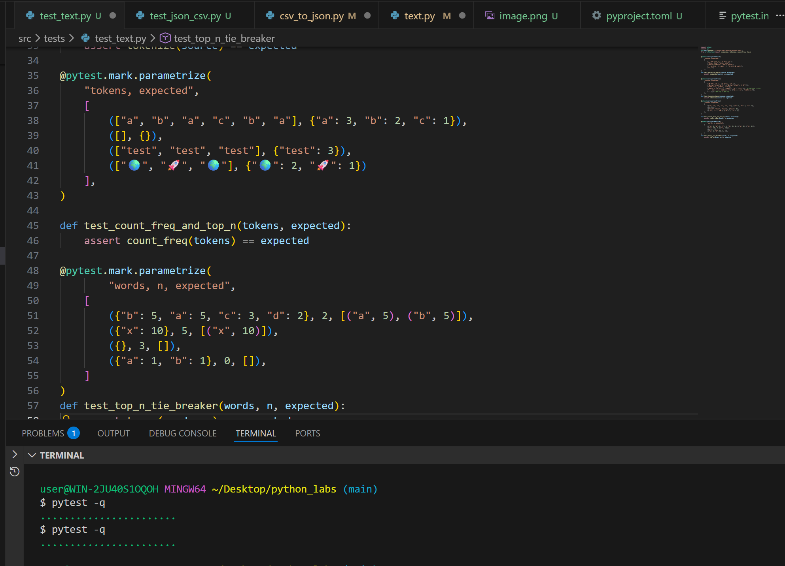
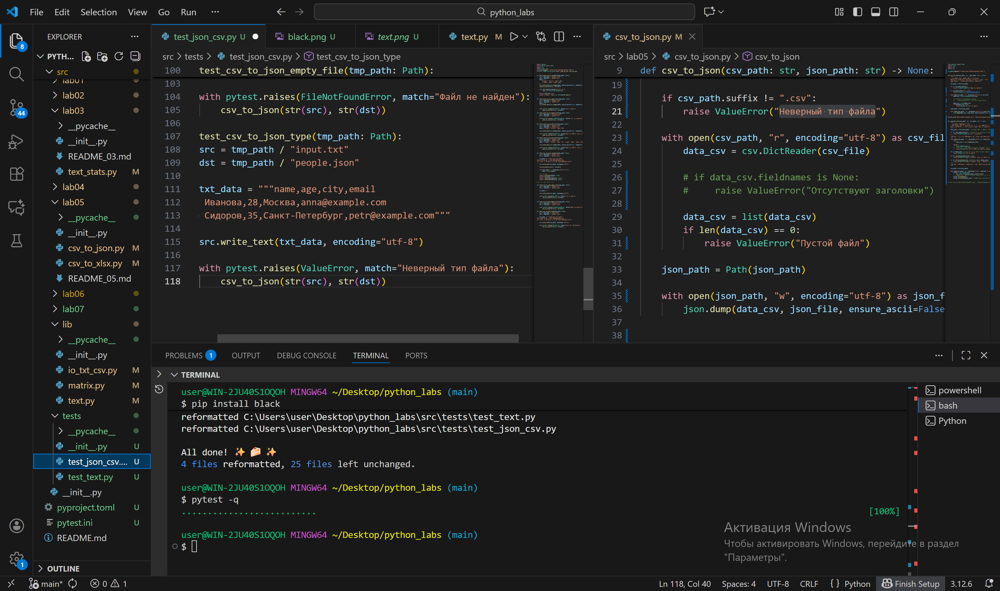
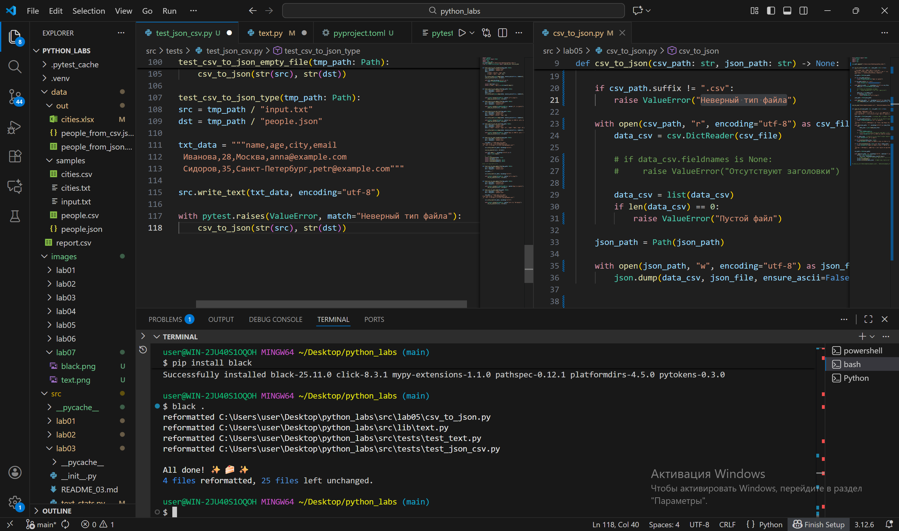

## LAB_07

### Предустановки
> Добавить файл pyproject.toml для настройки поведения тестов
> Установить pytest и black, совместимые с версией Python

### Задание A: test_text
```py
import pytest
import sys
from src.lib.text import normalize, tokenize, count_freq, top_n


""" Проводим параметризацию, далее - для каждого теста. """
@pytest.mark.parametrize(
    "source, expected",
    [
        ("ПрИвЕт\nМИр\t", "привет мир"),
        ("ёжик, Ёлкa", "ежик, елкa"),
        ("Hello\r\nWorld", "hello world"),
        ("  двойные   пробелы  ", "двойные пробелы"),
        ("", "")
    ],
)
def test_normalize_basic(source, expected):
    assert normalize(source) == expected


@pytest.mark.parametrize(
    "source, expected",
    [
        ("привет, мир!", ["привет", "мир"]),
        ("по-настоящему круто", ["по-настоящему", "круто"]),   # работа с дефисом
        ("2025 год", ["2025", "год"]),   # чтение 
        ("emoji 😀 не слово", ["emoji", "не", "слово"]),    # удаление эмоджи
        ("    мноооооого ненужного!!", ["мноооооого", "ненужного"]),
        ("", [])   # пустой -> пустой
    ],
)
def test_tokenize_basic(source, expected):
    assert tokenize(source) == expected
    
@pytest.mark.parametrize(
    "tokens, expected",
    [
        (["a", "b", "a", "c", "b", "a"], {"a": 3, "b": 2, "c": 1}),
        ([], {}),   # пустой -> пустой
        (["test", "test", "test"], {"test": 3}),   #одинаковые слова
        (["🌍", "🚀", "🌍"], {"🌍": 2, "🚀": 1})   # обработка эмодзи
    ],
)

def test_count_freq_and_top_n(tokens, expected):
    assert count_freq(tokens) == expected

@pytest.mark.parametrize(
        "words, n, expected",
    [
        ({"b": 5, "a": 5, "c": 3, "d": 2}, 2, [("a", 5), ("b", 5)]),  # равные значения -> по алфавиту
        ({"x": 10}, 5, [("x", 10)]),   # n > dicts
        ({}, 3, []),   # пустой -> пустой
        ({"a": 1, "b": 1}, 0, []),   # n = 0
    ]
)
def test_top_n_tie_breaker(words, n, expected):
    assert top_n(words, n) == expected
```



### Задание B: json2csv и csv2json
```py
import pytest
from pathlib import Path
import sys
import json, csv
from src.lab05.csv_to_json import json_to_csv, csv_to_json


"""
С помощью фикстуры tmp_path создаём временные файлы для чтения и записы данных.
1 тест - проверка правильности записи базового случая
"""
def test_json_to_csv_roundtrip(tmp_path: Path):
    src = tmp_path / "people.json"
    dst = tmp_path / "people.csv"
    data = [
        {"name": "Alice", "age": 22},
        {"name": "Bob", "age": 25},
    ]
    src.write_text(json.dumps(data, ensure_ascii=False, indent=2), encoding="utf-8")
    json_to_csv(str(src), str(dst))

    with dst.open(encoding="utf-8") as f:
        rows = list(csv.DictReader(f))

    assert len(rows) == 2
    assert {"name", "age"} <= set(rows[0].keys())

"""Пустой файл"""
def test_json_to_csv_empty_file(tmp_path: Path):
    src = tmp_path / "people.json"
    dst = tmp_path / "people.csv"
    data = []
    src.write_text(json.dumps(data, ensure_ascii=False, indent=2), encoding="utf-8")


    with pytest.raises(ValueError, match="Пустой файл"):
        json_to_csv(str(src), str(dst))

"""Несуществующий путь"""
def test_json_to_csv_empty_file(tmp_path: Path):
    src = tmp_path / "nothing.json"
    dst = tmp_path / "people.csv"

    with pytest.raises(FileNotFoundError, match="Путь не найден"):
        json_to_csv(str(src), str(dst))

"""1 проверка формата"""
def test_json_to_csv_not_list(tmp_path: Path):
    src = tmp_path / "people.json"
    dst = tmp_path / "people.csv"
    data = {"name": "Alice", "age": 22}
    
    src.write_text(json.dumps(data, ensure_ascii=False, indent=2), encoding="utf-8")

    with pytest.raises(ValueError, match="Файл не JSON формата: не список словарей"):
        json_to_csv(str(src), str(dst))

"""2 проверка формата"""
def test_json_to_csv_not_dict(tmp_path: Path):
    src = tmp_path / "people.json"
    dst = tmp_path / "people.csv"
    data = ['name": "Alice", "age": 22', 'name": "Bob", "age": 25']
    
    src.write_text(json.dumps(data, ensure_ascii=False, indent=2), encoding="utf-8")

    with pytest.raises(ValueError, match="Файл не JSON формата: в списке не словари"):
        json_to_csv(str(src), str(dst))


"""Аналогично для обратного перевода"""
def test_csv_to_json_roundtrip(tmp_path: Path):
    src = tmp_path / "people.csv"
    dst = tmp_path / "people.json"

    csv_data = """name,age,city,email
Анна Иванова,28,Москва,anna@example.com
Петр Сидоров,35,Санкт-Петербург,petr@example.com"""

    src.write_text(csv_data, encoding="utf-8")

    csv_to_json(str(src), str(dst))

    with dst.open('r', encoding="utf-8") as f:
        data = json.load(f)
    
    # Проверка 
    assert isinstance(data, list)
    assert len(data) == 2
    assert isinstance(data[0], dict)
    assert isinstance(data[1], dict)

# Бро вот еще тесты и тд

"""Пустой файл"""
def test_csv_to_json_empty_file(tmp_path: Path):
    src = tmp_path / "people.csv"
    dst = tmp_path / "people.json"

    csv_data = ""

    src.write_text(csv_data, encoding="utf-8")

    with pytest.raises(ValueError, match="Пустой файл"):
        csv_to_json(str(src), str(dst))
    
"""Несуществующий файл"""
def test_csv_to_json_empty_file(tmp_path: Path):
    src = tmp_path / "nothing.csv"
    dst = tmp_path / "people.json"

    with pytest.raises(FileNotFoundError, match="Файл не найден"):
        csv_to_json(str(src), str(dst))

"""Не тот формат файла"""
def test_csv_to_json_type(tmp_path: Path):
    src = tmp_path / "input.txt"
    dst = tmp_path / "people.json"

    txt_data = """name,age,city,email
Анна Иванова,28,Москва,anna@example.com
Петр Сидоров,35,Санкт-Петербург,petr@example.com"""

    src.write_text(txt_data, encoding="utf-8")

    with pytest.raises(ValueError, match="Неверный тип файла"):
        csv_to_json(str(src), str(dst))
```


### Задание С: black
> Все файлы приведены к читаемому виду

